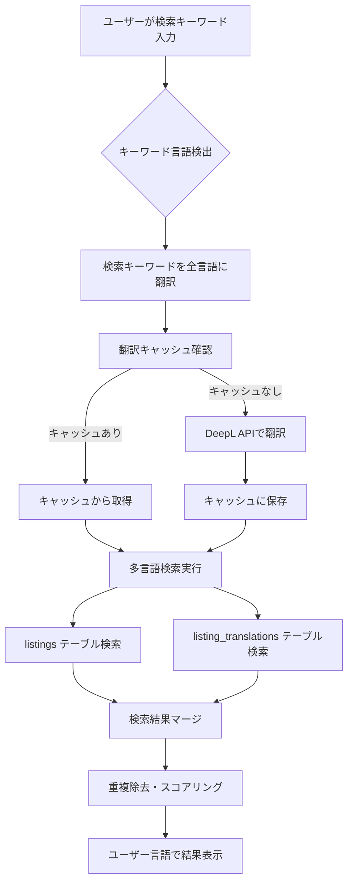
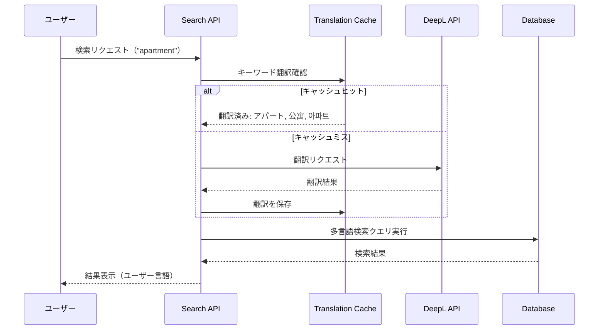
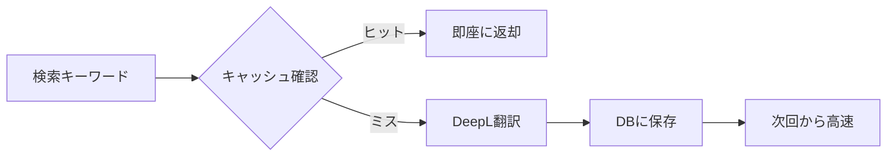

# クロスリンガル検索実装ガイド

## 概要

クロスリンガル検索により、ユーザーは任意の言語でコンテンツを検索でき、全言語のリスティングから関連する結果を取得できます。

## 実装後の動作フロー



## コア実装コンポーネント

### 1. 検索キーワード翻訳システム



### 2. データベース検索ロジック

```sql
-- 実装される search_listings_multilingual 関数の概要
CREATE OR REPLACE FUNCTION search_listings_multilingual(
  p_q text,                        -- 検索キーワード
  p_user_locale varchar,           -- ユーザーの言語
  p_crosslingual boolean DEFAULT true,  -- クロスリンガル検索有効/無効
  -- 既存のパラメータ（カテゴリ、場所、価格など）
) RETURNS TABLE (
  -- 既存のフィールドに加えて
  matched_locale varchar,          -- マッチした言語
  is_translated boolean,           -- 翻訳コンテンツかどうか
  translation_title varchar,       -- ユーザー言語での翻訳タイトル
  translation_body text           -- ユーザー言語での翻訳本文
)
```

## TDD実装ワークフロー

### Phase 1: 基盤準備

#### データベース拡張
- [ ] 翻訳検索用インデックス作成
  ```sql
  CREATE INDEX idx_listing_translations_fulltext 
  ON listing_translations 
  USING gin(to_tsvector('simple', title || ' ' || body));
  ```
- [ ] `search_listings_multilingual` RPC関数の作成

### Phase 2: 検索キーワード翻訳

#### 実装内容
- [ ] `app/lib/translation/search-translator.ts` 作成
  ```typescript
  export async function translateSearchKeyword(
    keyword: string,
    targetLocales: string[]
  ): Promise<TranslationResult[]>
  ```
- [ ] キャッシュロジック実装（`search_keyword_translations`テーブル使用）

### Phase 3: 検索API拡張

#### 実装内容
- [ ] `/api/listings/search/route.ts` の更新
  - 新パラメータ: `locale`（ユーザー言語）、`crosslingual`（フラグ）
  - 新RPC関数の呼び出し
  - レスポンスに言語情報追加

### Phase 4: フロントエンド統合

#### 実装内容
- [ ] `SearchForm.tsx` にクロスリンガル検索オプション追加
- [ ] `ListingCard.tsx` に翻訳インジケーター追加
  ```typescript
  {listing.is_translated && (
    <Badge variant="secondary">
      {t('translatedFrom', { lang: listing.original_language })}
    </Badge>
  )}
  ```

## 実装後の検索体験

### ユーザーシナリオ例

1. **英語話者が日本語コンテンツを発見**
   - 検索: "apartment near Shinjuku"
   - ヒット: 「新宿駅近くのアパート」（日本語リスティング）
   - 表示: 英語に自動翻訳されたタイトルと説明

2. **日本語話者が英語コンテンツを発見**
   - 検索: "仕事"
   - ヒット: "English teaching job"（英語リスティング）
   - 表示: 日本語に自動翻訳されたタイトルと説明

3. **中国語話者が韓国語コンテンツを発見**
   - 検索: "兼职" (アルバイト)
   - ヒット: "아르바이트"（韓国語リスティング）
   - 表示: 中国語に自動翻訳されたタイトルと説明

## パフォーマンス最適化

### キャッシュ戦略


### インデックス活用
- 全文検索インデックスで高速検索
- 言語別インデックスで効率的なフィルタリング

## 成功指標

- **検索精度**: 90%以上の関連性
- **レスポンス時間**: 500ms以下（95パーセンタイル）
- **キャッシュヒット率**: 80%以上（頻出キーワード）

## 実装チェックリスト

### 必須実装項目
- [ ] データベース: `search_listings_multilingual` RPC関数
- [ ] API: 検索キーワード翻訳サービス
- [ ] API: 検索エンドポイントの拡張
- [ ] UI: クロスリンガル検索オプション
- [ ] UI: 翻訳コンテンツのインジケーター

### テスト項目
- [ ] 単体テスト: キーワード翻訳ロジック
- [ ] 統合テスト: 多言語検索フロー
- [ ] E2Eテスト: ユーザーシナリオ
- [ ] 負荷テスト: パフォーマンス検証