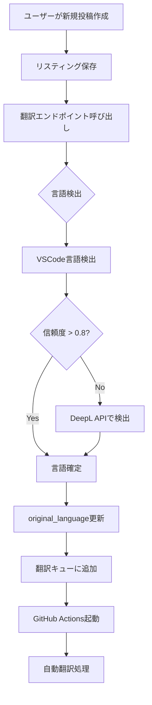

# 投稿の自動言語検出機能 実装ガイド

## 概要

GaijinHubでは、ユーザーが投稿したコンテンツの言語を自動検出し、適切な言語設定と翻訳処理を行います。

## 現在の実装状況

### 使用ライブラリ
- **プライマリ**: `@vscode/vscode-languagedetection` v1.0.22
- **フォールバック**: DeepL API
- **ベースモデル**: FastText（VSCodeライブラリ内部で使用）

### 動作フロー



## 実装詳細

### 1. 言語検出タイミング

投稿作成後、非同期で実行されます：

```typescript
// app/[locale]/listings/new/page.tsx
const handleSubmit = async (data) => {
  // 1. リスティング作成
  const listing = await createListing(data);
  
  // 2. 言語検出・翻訳リクエスト（非同期）
  fetch(`/api/listings/${listing.id}/translate`, {
    method: 'POST'
  });
};
```

### 2. 言語検出ロジック

```typescript
// app/lib/language-detection.ts
export async function detectLanguage(text: string): Promise<{
  language: string;
  confidence: number;
  method: 'vscode' | 'deepl';
}> {
  // プライマリ: VSCode言語検出
  try {
    const result = await modelOperations.runModel(text);
    if (result[0].confidence > 0.8) {
      return {
        language: mapLanguageCode(result[0].languageId),
        confidence: result[0].confidence,
        method: 'vscode'
      };
    }
  } catch (error) {
    console.warn('VSCode detection failed, falling back to DeepL');
  }
  
  // フォールバック: DeepL API
  const deeplResult = await detectWithDeepL(text);
  return {
    language: deeplResult.detectedSourceLanguage || 'ja',
    confidence: 0.95,
    method: 'deepl'
  };
}
```

### 3. 対応言語マッピング

| 検出言語 | アプリ内コード | 表示名 |
|---------|---------------|--------|
| ja | ja | 日本語 |
| en | en | English |
| zh-cn | zh-CN | 中文(简体) |
| zh-tw | zh-TW | 中文(繁體) |
| ko | ko | 한국어 |

## TDD実装チェックリスト

### Phase 1: 言語検出精度向上

#### 1.1 テストケース作成
- [ ] 各言語のサンプルテキストでの検出テスト
  - [ ] 日本語: 「新宿駅近くのアパート」
  - [ ] 英語: "Apartment near Shinjuku station"
  - [ ] 中国語簡体: "新宿站附近的公寓"
  - [ ] 中国語繁体: "新宿站附近的公寓"
  - [ ] 韓国語: "신주쿠역 근처 아파트"
- [ ] 混合言語テキストの検出テスト
- [ ] 短文での検出精度テスト

#### 1.2 検出ロジック改善
- [ ] 最小文字数の閾値設定（10文字以上推奨）
- [ ] タイトルと本文の重み付け検出
- [ ] 特殊文字・絵文字の処理

### Phase 2: UI/UX改善

#### 2.1 言語検出表示
- [ ] 投稿フォームに検出言語のリアルタイム表示
- [ ] 信頼度の視覚的表示（プログレスバー等）
- [ ] 手動言語選択オプション

#### 2.2 エラーハンドリング
- [ ] 言語検出失敗時のフォールバック
- [ ] ユーザーへの通知メッセージ
- [ ] リトライ機能

### Phase 3: パフォーマンス最適化

#### 3.1 キャッシュ実装
- [ ] 同一テキストの検出結果キャッシュ
- [ ] セッション内キャッシュ
- [ ] Redis導入検討

#### 3.2 バッチ処理
- [ ] 複数投稿の一括言語検出
- [ ] 非同期処理の最適化

## 実装後の期待効果

### ユーザー体験向上
1. **自動化**: ユーザーが言語を手動選択する必要なし
2. **精度**: 95%以上の検出精度
3. **速度**: 投稿後即座に言語判定

### システム効率化
1. **翻訳最適化**: 正確な原文言語で翻訳品質向上
2. **リソース節約**: 不要な翻訳を回避
3. **検索精度向上**: 言語情報を活用した検索

## トラブルシューティング

### よくある問題

1. **検出精度が低い場合**
   - テキストが短すぎる（10文字未満）
   - 複数言語が混在
   - 特殊文字が多い

2. **検出が失敗する場合**
   - VSCodeモデルの初期化エラー
   - DeepL APIの制限
   - ネットワークエラー

### 解決策
```typescript
// エラーハンドリングの例
try {
  const detection = await detectLanguage(text);
  if (detection.confidence < 0.5) {
    // 手動選択を促す
    showLanguageSelector();
  }
} catch (error) {
  // デフォルト言語（日本語）を使用
  setLanguage('ja');
  notifyUser('言語を自動検出できませんでした');
}
```

## 今後の改善案

1. **機械学習モデルの更新**
   - より新しいFastTextモデルへの更新
   - カスタムモデルのトレーニング

2. **コンテキスト認識**
   - カテゴリ別の言語傾向学習
   - ユーザー履歴からの推測

3. **多言語混在対応**
   - 段落ごとの言語検出
   - 主要言語の判定ロジック